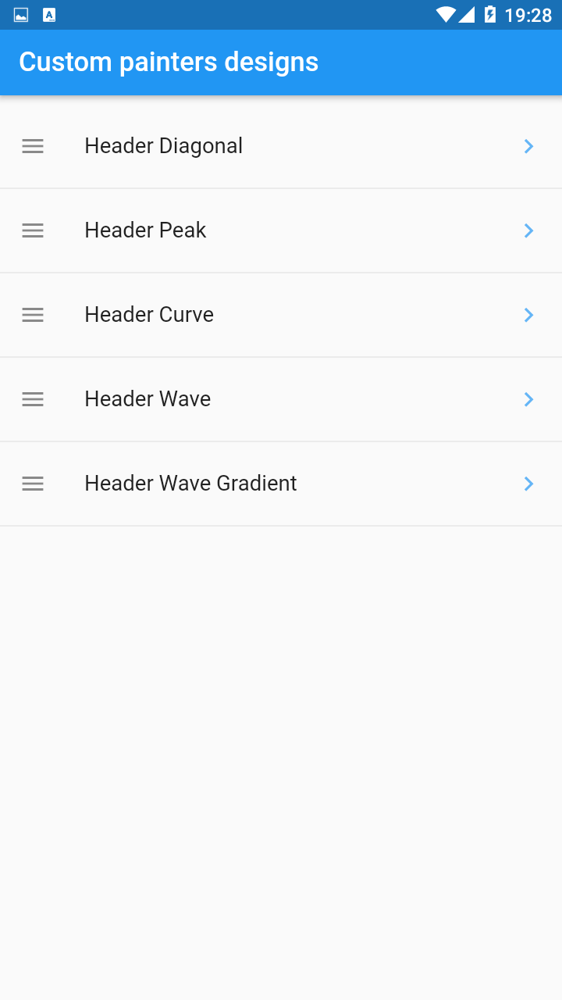

<h1 align="center">
  Custom painter
</h1>

<h2 align="center">
  
  
  
  
  
  
</h2>

<br />

## Used Packages

## Resources

## How to run

1. First clone the repo:

```bash
git clone https://github.com/alcampospalacios/flutter_customPainting.git
```

<br />

2. In the repo path:

```bash
flutter pub get
```

<br />

3. And finally:

```bash
flutter run
```
